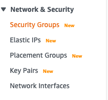

# Prepare EC2 instance for deploy Rails app

1. Create EC2 instance
Login to AWS console
In the find service input find EC2

*Before create EC2 instance, we are going to create sercurity_group for all EC2 instance running rails*
in the left side bar, click on **sercurity group**

